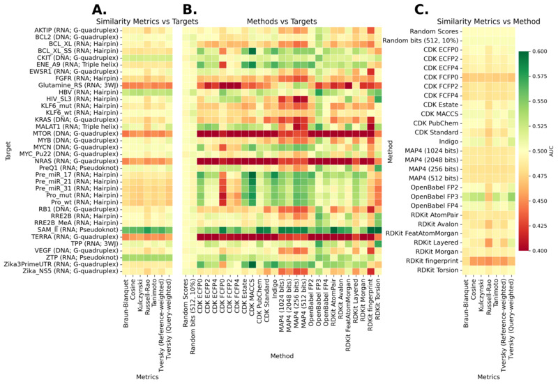

# RNA Ligand-Based Similarity Analysis

> [!NOTE] 
> This repository contains data and scripts for analyzing ligand-based similarity metrics and molecular fingerprints in the context of RNA-targeted small molecule discovery. The content is related to scientific publication:
> Bajusz, D., Rácz, A., Bujnicki, J. M., & Stefaniak, F. (2025). Evaluation of single-template ligand-based methods for the discovery of small-molecule nucleic acid binders. Briefings in Bioinformatics, 26(6), bbaf620, [https://doi.org/10.1093/bib/bbaf620](https://doi.org/10.1093/bib/bbaf620)
> 

 DOI: [10.5281/zenodo.15683151](https://doi.org/10.5281/zenodo.15683151)

 

## Repository Structure

#### 📂 `1-fingerprints/`
Contains molecular fingerprint datasets in compressed CSV format. Each file represents a different fingerprinting method (e.g., CDK ECFP, FCFP, MACCS, PubChem, Indigo, MAP4, OpenBabel, RDKit, random bits).

#### 📂 `descriptors/`

Contains molecular descriptors calculated for all ligands.

#### 📂 `3-metrics/`

Contains statistical analyses and metrics, including t-tests comparing the performance of different methods and random baselines.  
  - `metrics__ttest.csv`: Summary of statistical tests for various methods.
  - `combined_best_metrics.csv.gz`: combined values for all methods and all similarity metrics
  - `individual_metrics/`: Individual metrics for fingerprints (all subdirectories) and individual ligand-based methods (`tanimoto` directory). The best-performing variants of all methods are in `_best` directory.

#### 📂 `p-values`

Contains average values for the performance metrics with the statistical significance p-values

#### 📂 `4-ANOVA/`

Contains results of ANOVA analyses and interaction means for different factors:
  - `F1_weighted_means.csv`, `F2_weighted_means.csv`, `F3_weighted_means.csv`: Weighted means for different factors.
  - `F1_F2_interaction_means.csv`, `F2_F3_interaction_means.csv`, `F3_F1_interaction_means.csv`: Interaction means between factors.

#### 📂 `Pooled_ROC`

Plots of pooled ROC curves for selected methods and all targets

#### 📂 `5-case-study/`

Contains case studies data for Glutamine_RS.

#### 📂 `6-FP3_analysis/`

Contains results of FP3 fingerprint analysis. 

#### 📂 `7-docking/`

Results of molecular docking:
- `1-macromolecules` - nucleic acid targets used for docking
- `1-results-sdf/` - docked poses
- `2-scores/` - scores extracted from sdf files
- `3-performance/` - performance metrics

#### 📂 `code/`

Programs used to perform calculations.

## 📰 Citation

If you use this repository or its data in your research, please cite the relevant publication or acknowledge the authors:

Bajusz, D., Rácz, A., Bujnicki, J. M., & Stefaniak, F. (2025). Evaluation of single-template ligand-based methods for the discovery of small-molecule nucleic acid binders. Briefings in Bioinformatics, 26(6), bbaf620, [https://doi.org/10.1093/bib/bbaf620](https://doi.org/10.1093/bib/bbaf620)
